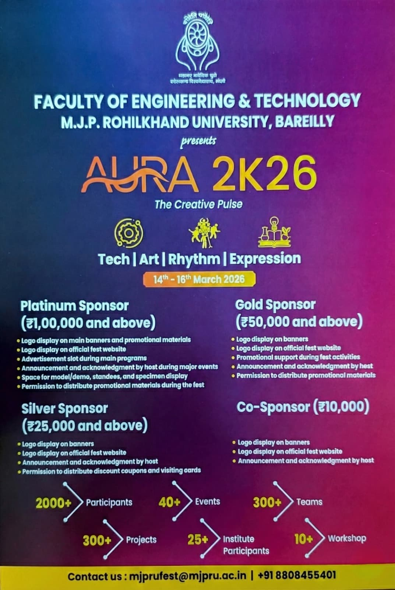

# MJPRU-tech-fest-website
<div align="center">
  
  
  # 🌟 MJPRU TECH FEST 2026 | AURA 2K26 🌟
  
  **The Grandest Gathering of Minds: Innovate | Create | Compete**

  [](https://en.wikipedia.org/wiki/HTML5)
  [](https://en.wikipedia.org/wiki/CSS3)
  [](https://developer.mozilla.org/en-US/docs/Web/JavaScript)
  []()
</div>

<br/>


## 📖 About The Project

Welcome to the official repository for **AURA 2K26**, the grand Technical, Cultural, and Literary Fest organized by the Faculty of Engineering & Technology at **Mahatma Jyotiba Phule Rohilkhand University (MJPRU), Bareilly**.

This interactive, highly-responsive web portal serves as the digital face of the event, offering participants information regarding the schedule, events, faculty members, and registration processes. The portal is equipped with beautiful animations, an integrated mascot, and seamless navigation.

### ✨ Key Features

- **🚀 Dynamic Hero Section:** Canvas-based interactive particle effects and a live countdown timer to the event.
- **📱 Fully Responsive Design:** Flawless experience across desktop, tablet, and mobile screens.
- **🎨 Modern UI/UX:** Glassmorphism, smooth scrolling, gradient typography, and scroll animations using AOS (Animate On Scroll).
- **🗣️ Interactive Mascot:** A custom floating mascot to guide users through the portal.
- **📅 Categorized Event Sections:** Separate modules for Technical, Cultural, Literary, Sports, Workshops, and Rhythm.
- **ℹ️ Complete Information Hub:** Includes Vice Chancellor & Dean's desk, FAQs, Sponsorships, Accommodation details, and a dedicated Developer Team Portal.

---

## 🛠️ Built With

This project relies purely on modern web fundamentals without the overhead of heavy frameworks:

* **HTML5:** Semantic structuring and SEO-friendly metadata.
* **CSS3:** Custom properties, CSS Grid/Flexbox, animations, and media queries for responsiveness.
* **JavaScript (Vanilla):** DOM manipulation, modal handling, countdown timer, and interactive canvas logic.
* **Libraries/Assets:**
  * [FontAwesome (6.5.1)](https://fontawesome.com/) - For beautiful UI icons.
  * [AOS (Animate On Scroll)](https://michalsnik.github.io/aos/) - For smooth reveal animations.
  * [Google Fonts](https://fonts.google.com/) - Playfair Display, Poppins, Great Vibes.

---

## 🚀 Getting Started

Follow these instructions to set up the project locally on your machine for development and testing.

### Prerequisites

You only need a modern web browser. A code editor like [VS Code](https://code.visualstudio.com/) is recommended.

### Installation & Run Commands

1. **Clone the repository** (if hosted on Git):
   ```bash
   git clone https://github.com/yourusername/MJPRU-tech-fest-website.git
   ```

2. **Navigate to the project directory:**
   ```bash
   cd MJPRU-tech-fest-website
   ```

3. **Run the Application:**
   Since this is a static website, you do not need a complex build step or server setup. 
   * **Method 1 (Simple):** Just double-click the `index.html` file to open it in your default web browser.
   * **Method 2 (Recommended for Developers):** If you are using VS Code, install the **[Live Server](https://marketplace.visualstudio.com/items?itemName=ritwickdey.LiveServer)** extension. Right-click on `index.html` and select **"Open with Live Server"**. This will serve the site at `http://127.0.0.1:5500/` and auto-reload upon changes.

---

## 📂 Project Structure

```text
d:\Project\MJPRUtechfestwebsite\
├── index.html        # Main landing page for AURA 2K26
├── style.css         # Global stylesheets and layout styling
├── script.js         # Core functionality (countdown, modals, interactions)
├── mascot.js         # Logic for the interactive floating mascot
├── image/            # Directory containing all visual assets (logos, campus images, sponsors)
├── technical/        # Details and forms for Technical events
├── cultural/         # Details and forms for Cultural events
├── literacy/         # Details and forms for Literary events
├── sports/           # Details and forms for Sports events
├── workshop/         # Details and forms for Workshops
├── Rhythm/           # Details for Rhythm Decoration & Open Mic
└── 1/                # Favicon and manifest assets
```

---

## 📸 Screenshots & Highlights

Here are some glimpses of what the portal looks like:

| Event Cards & Navigation | Sponsorship & Partnerships |
| :---: | :---: |
|  |  |

*(Note: Explore the `image/` directory to see more stunning shots of the 206.7 acres grand campus including the Atal Auditorium, Botanical Garden, and Stadium.)*

---

## 🤝 The Development Team

Crafted with ❤️ by **IT CLINIC, MJPRU**.

**Faculty Coordinator:**
- Dr. Anil Kumar Bisht

**Student Coordinators (Web Developers):**
- [Mayank Kalra](https://www.linkedin.com/in/mayank-kalra-b70241324)
- [Ishu Singh](https://www.linkedin.com/in/ishu-singh-796707325)
- [Deepak Gangwar](https://www.linkedin.com/in/deepak-gangwar-66b4233b3/)
- [Aatif Ahmed Khan](https://www.linkedin.com/in/aatif-khan-2b1805304)

---

## 📞 Contact & Support

For queries related to events, sponsorships, or general information:
- 📧 **Email:** [mjprufest@mjpru.ac.in](mailto:mjprufest@mjpru.ac.in)
- 📍 **Address:** M.J.P. ROHILKHAND UNIVERSITY, Pilibhit By Pass Road, Bareilly, 243006, (U.P) INDIA
- 🌐 **Socials:** 
  - [Instagram](https://www.instagram.com/aura2k26mjpru)
  - [Facebook](https://www.facebook.com/share/1GsVGf7cEn/)
  - [YouTube](https://youtube.com/@aura2k26mjpru)
  - [Twitter (X)](https://x.com/aura2k26mjpru)

---

<p align="center">
  <i>"Let this fest ignite your passion, strengthen your resolve, and remind you that the future belongs to those who dare to dream and strive."</i>
</p>
